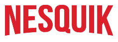

<!-- PROJECT LOGO -->
<br />
<div align="center">
  <a href="https://github.com/navid9696/nesquik/tree/main/public/assets/logo.png">
    
  </a>

  <h3 align="center">Nesquik, a Netflix clone-like site</h3>

  <p align="center">
    <br />
    <a href="https://www.piekarniabrzeczek.pl/">View site</a>
  
  </p>
</div>


<!-- ABOUT THE PROJECT -->
## About The Project


<p align="right">(<a href="#readme-top">back to top</a>)</p>


### Built With


[](https://skillicons.dev)

<p align="right">(<a href="#readme-top">back to top</a>)</p>


<!-- GETTING STARTED -->

### Installation


1. Clone the repo
   ```sh
   git clone https://github.com/navid9696/nesquik.git
   ```
2. Install NPM packages
   ```sh
   npm install
   ```
3. Run 
   ```sh
   npm run dev
   ```

<p align="right">(<a href="#readme-top">back to top</a>)</p>


<!-- LICENSE -->
## License

Distributed under the MIT License. See `LICENSE.txt` for more information.

<p align="right">(<a href="#readme-top">back to top</a>)</p>


<!-- CONTACT -->
## Contact

Dawid Brzęczek - dawidbrzeczek18@gmail.com

Project Link: [https://github.com/navid9696/nesquikL](https://github.com/navid9696/nesquik)

<p align="right">(<a href="#readme-top">back to top</a>)</p>


